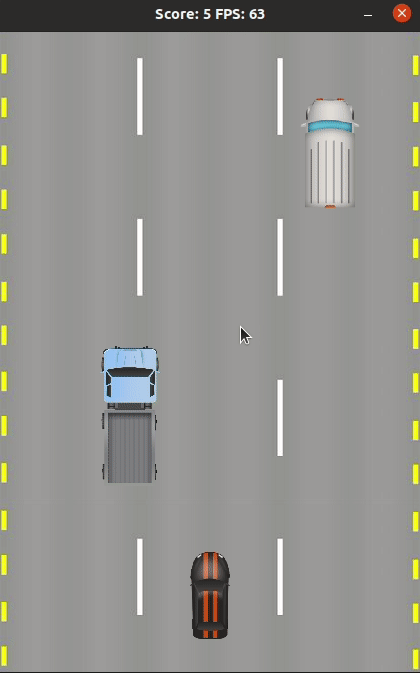

# CPPND: Capstone Car Racing Game

A simple 2D endless Car racing game developed using C++ and SDL.

This repository is for the Capstone project required for completing [Udacity C++ Nanodegree Program](https://www.udacity.com/course/c-plus-plus-nanodegree--nd213). The code is based on the [Capstone Snake Game Example](https://github.com/udacity/CppND-Capstone-Snake-Game) provided by Udacity.

## Udacity Capstone Project Requirements (Rubric Points)

This project fulfills the below Rubric points:

### 1. README (All Rubric Points REQUIRED)

* A README with instructions is included with the project
  * Yes
* The README indicates which project is chosen
  * Yes
* The README includes information about each rubric point addressed
  * Yes.

### 2. Compiling and Testing (All Rubric Points REQUIRED)

* The submission must compile and run
  * Yes, Program compiles and runs sucessfully.

### 3. Loops, Functions, I/O

* The project demonstrates an understanding of C++ functions and control structures
  * Project uses if-else, switch , while loop, for loop, system defined, and user defined functions.

* The project accepts user input and processes the input
  * Project accepts user input to move vehicle left and right.

### 4. Object Oriented Programming

* The project uses Object Oriented Programming techniques
  * Yes.
* Classes use appropriate access specifiers for class members
  * Yes.
* Class constructors utilize member initialization lists
  * Yes: please refer code e.g. `game.cpp` or `traffic_generator.cpp`.
* Classes encapsulate behavior
  * Yes: e.g. `TrafficGenerator::GenerateVehicle()` in `trafficgenerator.h`, `Vehicle::CheckCollision()` in `vehicle.h`, etc.
* Classes follow an appropriate inheritance hierarchy
  * Yes, Player, Vehicle, and Track inherits from GameObject class.

### 5. Memory Management

* The project makes use of references in function declarations
  * Yes.
* The project uses destructors appropriately
  * Yes, Project uses smart pointers.
* The project follows the Rule of 5
  * No: smart pointers are used instead.
* The project uses smart pointers instead of raw pointers
  * Yes, shared smart pointers are used.

### 6. Concurrency

* The project does not uses multithreading.

## Dependencies for Running Locally
* cmake >= 3.7
  * All OSes: [click here for installation instructions](https://cmake.org/install/)
* make >= 4.1 (Linux, Mac), 3.81 (Windows)
  * Linux: make is installed by default on most Linux distros
  * Mac: [install Xcode command line tools to get make](https://developer.apple.com/xcode/features/)
  * Windows: [Click here for installation instructions](http://gnuwin32.sourceforge.net/packages/make.htm)
* SDL2 >= 2.0
  * All installation instructions can be found [here](https://wiki.libsdl.org/Installation)
  * Note that for Linux, an `apt` or `apt-get` installation is preferred to building from source.
* gcc/g++ >= 5.4
  * Linux: gcc / g++ is installed by default on most Linux distros
  * Mac: same deal as make - [install Xcode command line tools](https://developer.apple.com/xcode/features/)
  * Windows: recommend using [MinGW](http://www.mingw.org/)

## Basic Build Instructions

1. Clone this repository.
2. Make a build directory in the top level directory: `mkdir build && cd build`
3. Compile: `cmake .. && make`
4. Run it: `./RoadRacing`.